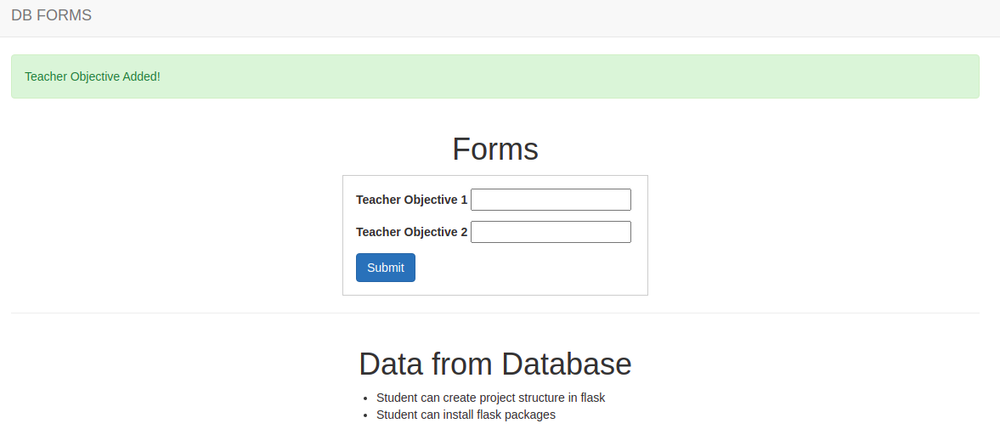

# Create Forms based on Model's Schema

It is possible that you can create forms based on a model's schema. Rather than creating a `forms` model in your application instance that defines a form you want, you can map the structure of a model to a form. 



## How To

* Install `wtforms-sqlalchemy`:
    ```python
    (venv)$ pip3 install wtforms-sqlalchemy
    ```
* Create a model:
    ```python
    class TestModel(db.Model):
        __tablename__ = 'test model'
        id = db.Column(db.Integer, primary_key=True)
        objective_1 = db.Column(db.String(100))
        objective_1 = db.Column(db.String(100))

        def __repr__(self):
            return f'TestModel: {self.objective_1}'
    
    # Create table migrations using flask-migrate package
    ```
* Render the form:
    ```python
    from wtforms_sqlalchemy.orm import model_form

    @app.route('/', methods=['GET', 'POST'])
    def index():
        # Create form object from the model
        TestModelForm = model_form(TestModel)

        # Create model object
        test_model = TestModel()

        # Create form and populate it with data from the model
        if request.method == 'POST':
            form = TestModelForm(request.form, obj=test_model)
            if form.validate():
                # Save the form data
                form.populate_obj(test_model)
                db.session.add(test_model)
                db.session.commit()
                return redirect(url_for('index'))
        else:
            form = TestModelForm(obj=test_model)

        # Get db data
        test_model_data = TestModel.query.all()

        return render_template(
            'index.html',
            title='Home',
            form=form,
            test_model_data=test_model_data
            )
    ```
* Display form and form data
    ```python
    <form method="post" action="">
        
            <p>{{ field.label }} {{ field }}</p>
        
        <button type="submit" class="btn btn-primary">Submit</button>
    </form>
    <hr>
    
        <ul>
            <li>{{ data.objective_1 }}</li>
            <li>{{ data.objective_2 }}</li>
        </ul>
    
    ```

## Test The Application Locally

* Clone this repo:
    ```python
    $ git clone git@github.com:GitauHarrison/create-a-flask-form-directly-from-a-model-schema.git
    ```
* Moved into directory
    ```python
    $ cd create-a-flask-form-directly-from-a-model-schema
    ```
* Create and activate virtual environment
    ```python
    $ mkvirtualenv venv # I am using virtualenvwrapper
    ```
* Install dependencies
    ```python
    (venv)$ pip3 install -r requirements.txt
    ```
* Needed environment variables:
  * Create `.env`:
    ```python
    (venv)$ touch .env
    ```
  * Add environment variable as seen in `.env-template`:
    ```python
    SECRET_KEY=
    ```
    * Best to create SECRET_KEY value by running `python3 -c 'import os; print(os.urandom(16))'` in your terminal
* Start flask server
    ```python
    (venv)$ flask run
    ```
* Access the application on http://127.0.0.1:5000/